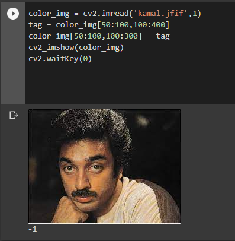

# READ AND WRITE AN IMAGE
## AIM
To write a python program using OpenCV to do the following image manipulations.
i) Read, display, and write an image.
ii) Access the rows and columns in an image.
iii) Cut and paste a small portion of the image.

## Software Required:
Anaconda - Python 3.7
## Algorithm:
### Step1:
Choose an image and save it as a filename.jpg
### Step2:
Use imread(filename, flags) to read the file.
### Step3:
Use imshow(window_name, image) to display the image.
### Step4:
Use imwrite(filename, image) to write the image.
### Step5:
End the program and close the output image windows.
## Program:
### Developed By: P.Sarveshvaran
### Register Number: 212221230090
i) #To Read,display the image
```
  

```
ii) #To write the image
```
  


```
iii) #Find the shape of the Image
```python3


```
iv) #To access rows and columns

```python3


```
v) #To cut and paste portion of image
```python3


```

## Output:

### i) Read and display the image

<br>

<br>

### ii)Write the image

<br>

<br>

### iii)Shape of the Image

<br>

<br>

### iv)Access rows and columns
<br>

<br>

### v)Cut and paste portion of image
<br>

<br>

## Result:
Thus the images are read, displayed, and written successfully using the python program.


